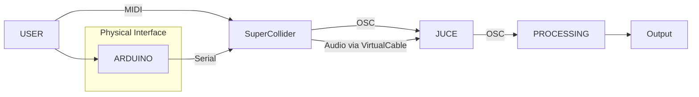
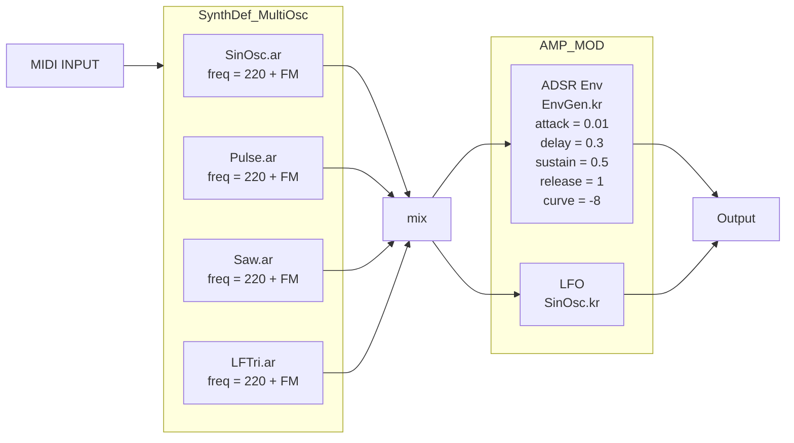

  

<h1 align="center">T.I.L.E.S</h1>

 TANGIBLE INTERFACE FOR LAYERED SOUND ELECTRONICS

### Description
The systems consist on a physical interface monitored by arduino that allows the user to create sound in Supercollider and apply different modifications through JUCE based plugins. All this supported by a visualizer working on processing.

### Motivation
The objective of this project is to provide unexperienced users an easy aproach to sound synthesis via an easy to use physical interface. Additionally, the physical interface is supported with braille and diferent relieves, enabling users with visual dificulties to freely explore and manipulate the interface.

### Schematic Diagram

### Table of Contents:
* Requirements
* Electronics
* Software Components
* Scope for Future Work
* Acknowledgement
* Contributors

### Requirements: 
#### Hardware:
* Cardboard
* Copper Proto board
* LEDs (Different Voltages)
* Diodes (1N4007)
* Cables
* Rotatory Potentiometers (50kΩ)
* Slider Potentiometers (10kΩ)
* Neodimium magnets
* Styrofoam for the “TILES”
* MIDI keyboard
* Arduino UNO
* Glue gun
* Pins with round head

#### Software:
* Supercollider: (https://supercollider.github.io/)
* JUCE Framework: (https://juce.com/)
* Projucer (For plugin setup and export)
* Arduino IDE: (https://www.arduino.cc/)
* Virtual Audio Cable Software (eg. BlackHole for macOS, VB-Audio Virtual Cable for Windows)

### Electronics:
This part const of two differentiated modules, tiles detection and potentiometer measuring. As the amount of voltage values to read it's higher than the amount of analog inputs, we require to use a matrix architecture, dividing the potentiometers and leds in groups (or colums) that can be activated at the moment of reading. This is perfomed by Arduino.

For the tiles detection, we meassure the voltage drop of leds of different colour. As this values can be very close sometimes, the led values are constantly being calibrated to avoid undesired alterations. Concerning the conection of the leds, it is done with magnets properly polarize to only attach in the right position of the led.

For the potentiometers, the are in divisor configuration to ensure lineal input. Also, diodes are required due to the matrix configuration previously mentioned. This restricts a bit the range of operation.

### Software Components:

#### Arduino:

The purspose of arduino is to read and codify the values obtained from the board. To do this, it first have to coordinate the activation of the different groups to be readed. This architecture implies that not every value can be readed in realtime, but the refresh rate for the complete system is below 0.1 seconds, so it is not perceivable by the user.

By reading the leds, Arduino can detect which led it is connected, and assign to it the corresponding waveform, effect, or filter. At the same time, arduino is reading the values of the potentiometers. 

Then, arduino correlates the connected tiles with the values in the pots, and via serial port, send the values for each waveform, effect, and filter to the computer, where is received by SuperCollider. 

#### Supercollider:
SuperCollider works as our software synthesizer controlled externally, integrating MIDI input for note playback with dynamic parameter control via a serial port. Upon execution, the code first prepares the SuperCollider server and initializes the MIDI system, enabling the program to receive and interpret musical performance data from an external (but can also be virtual) MIDI keyboard. This allows for standard note-on and note-off events to trigger and sustain/release sounds.

Simultaneously, the serial data collection routine actively listens for incoming data from the Arduino. A dedicated Routine continuously monitors this port, parsing data packets enclosed between '<' and '>' characters. Once a complete packet is received, it's split by commas, and the individual numeric values are assigned to distinct global variables such as ~volumes, ~adsr, ~fx, ~filters, ~masterVol, and ~pan. This continuous update of parameters means that physical adjustments made on the physical interface (e.g., turning knobs and moving sliders) are immediately reflected in the synthesizer's behavior.

The sonic core of our system is the SynthDef \multiOsc, which defines the architecture of a polyphonic synthesizer (capable of playing multiple notes concurrently). This includes four fundamental oscillators (sine, pulse, triangular, and saw), whose outputs are mixed together. The amplitude of each oscillator, as well as the overall shape of the note, is modulated by an ADSR envelope (EnvGen), which engages when a MIDI note is pressed and releases when it's lifted. Furthermore, Frequency Modulation (FM) and a Low Frequency Oscillator (LFO) are incorporated to add timbral richness and movement to the sound, controlling the oscillator frequencies and modulating the overall volume, respectively. All these elements are driven by the values constantly received from the serial port, meaning that adjusting each potentiometer on our physical interface alters the sound. Finally, the resulting signal is stereo-panned (Pan2) and sent to the audio outputs, ending in the digital instrument that responds to both MIDI commands and external control. 

The second script then establishes a series of helper functions to simplify sending OSC messages to JUCE. For the filter plugin, ~setFilter sends a /filter/active message to port 9001, along with the filter's name (e.g., "LPF" for Low Pass Filter) and an active state (1 for on, 0 for off). ~setCutoff sends a /filter/cutoff message, specifying the filter name and its desired frequency. Similarly, for the reverb plugin, ~setWet sends a /wet message to port 9002, controlling the wet/dry mix of the reverberation with a normalized value between 0.0 and 1.0. The distortion plugin is controlled by ~setDrive, which sends a /drive message to port 9003, also with a normalized value to adjust the amount of distortion. By encapsulating these commands in reusable functions, the code becomes cleaner and easier to manage. At the end the wetness of the reverb or the drive of the distortion is set, effectively turning SuperCollider into a real-time controller for JUCE-based effects. 

#### JUCE:

#### Processing: 
To enhance user interaction and provide visual insight into the sound being generated by the synthesizer, we developed a dual-mode graphical interface.

1. Waveform Mode:
In this mode, the interface displays the real-time audio waveform as it is produced by the synthesizer. This allows users to observe the dynamic behavior of the sound in response to various parameters such as the ADSR envelope, reverb, and distortion effects. It offers an intuitive way to understand how these elements shape the evolving audio signal.

2. Oscilloscope Mode:
This mode emulates the behavior of a traditional oscilloscope. It captures and displays a fixed-length segment of the waveform, starting from a defined trigger point. By presenting a static view of the waveform, users can more precisely analyze the characteristics of individual waveforms, observe interactions when multiple notes are played simultaneously, and examine how hard-clipping distortion alters the waveshape.

Both modes receive audio sample data via OSC (Open Sound Control) and store them in circular buffers tailored for each visualization mode. The waveforms are rendered on-screen along with a grid overlay to support accurate visual interpretation.

#### Communication Protocol: 

### Project Implementation:

### Scope for Future Work: 
* Multi-sensory Feedback for Broader Accesibility: By incorporating haptic motors, LEDs, or thermal feedback, we can make the experience richer for users with different sensory profiles (eg. deaf-blind users).

* Therapeutic Sound Interaction: We can collaborate with therapists to develop sound-based therapies for individuals with cognitive or sensory impairments. Music heals :D

### Acknowledgement: 
We extend our sincere gratitude to Professor Fabio Antonacci, Professor Antonio Giganti, Professor Davide Salvi for their invaluable guidance towards the development of this project.

### Contributions:
This system is the outcome of the project work undertaken for the “Computer Music - Languages and Systems” examination for the academic year 2024/2025 at Politecnico di Milano developed by the “International Love” team. The team members consist of: 

* Jorge Cuartero 🇪🇸
* Sebastian Gomez 🇲🇽
* Nicola Nespoli 🇮🇹
* Matteo Vitalone 🇫🇷
* Benedito Ferrao 🇮🇳
