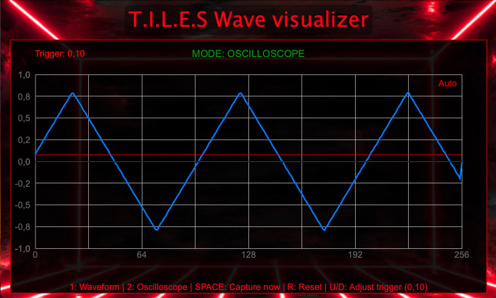

  

<h1 align="center">T.I.L.E.S</h1>

 TANGIBLE INTERFACE FOR LAYERED SOUND ELECTRONICS

### Description
Employing Supercollider as a sound source, we design an interface that enables analogue audio processing using Arduino as the communication protocol. We manipulate the audio through JUCE plugins for effects and utilise processing as the graphical user interface for visualisation.

### Motivation
The objective of this project is to provide individuals with disabilities with an immersive experience of sound processing through an analogue interface. Utilising pins, we create braille indents on our ‘tiles’, enabling the user to freely explore and manipulate the interface.

  

### Schematic Diagram

### Table of Contents:
* Requirements
* Electronics
* Software Components
* Demonstration
* Scope for Future Work
* Acknowledgement
* Contributors

### Requirements: 
#### Hardware:
* Cardboard
* Copper Proto board
* LEDs (Different Voltages)
* Diodes (1N4007)
* Cables
* Rotatory Potentiometers (50kΩ)
* Slider Potentiometers (10kΩ)
* Neodimium magnets
* Styrofoam for the “TILES”
* MIDI keyboard
* Arduino UNO
* Glue gun
* Pins with round head

#### Software:
* Supercollider: (https://supercollider.github.io/)
* JUCE Framework: (https://juce.com/)
* Projucer (For plugin setup and export)
* Arduino IDE: (https://www.arduino.cc/)
* Virtual Audio Cable Software (eg. BlackHole for macOS, VB-Audio Virtual Cable for Windows)
  
### Electronics:
This part const of two differentiated modules, tiles detection and potentiometer measuring. As the amount of voltage values to read it's higher than the amount of analog inputs, we require to use a matrix architecture, dividing the potentiometers and leds in groups (or colums) that can be activated at the moment of reading. This is perfomed by Arduino.

For the tiles detection, we meassure the voltage drop of leds of different colour. As this values can be very close sometimes, the led values are constantly being calibrated to avoid undesired alterations. Concerning the conection of the leds, it is done with magnets properly polarize to only attach in the right position of the led.

For the potentiometers, the are in divisor configuration to ensure lineal input. Also, diodes are required due to the matrix configuration previously mentioned. This restricts a bit the range of operation.

### Software Components:

#### Arduino:

The purspose of arduino is to read and codify the values obtained from the board. To do this, it first have to coordinate the activation of the different groups to be readed. This architecture implies that not every value can be readed in realtime, but the refresh rate for the complete system is below 0.1 seconds, so it is not perceivable by the user.

By reading the leds, Arduino can detect which led it is connected, and assign to it the corresponding waveform, effect, or filter. At the same time, arduino is constantly reading the values of the potentiometers. 

Then, arduino correlates the connected tiles with the values in the pots, and via serial port, send the values for each waveform, effect, and filter to the computer, where is received by SuperCollider. 

<table border="1" cellspacing="0" cellpadding="8" style="border-collapse: collapse; text-align: center;">
<tr style="background-color: #cccccc; color: black;">
    <th>Led</th>
    <th>Red</th>
    <th>Green</th>
    <th>Blue</th>
    <th>White</th>
  </tr>
  
  <tr>
    <td>Waveform</td>
    <td>Sine Wave</td>
    <td>Square Wave </td>
    <td>Triangle </td>
    <td>Saw </td>
  </tr>
    
  <tr>
    <td>FX</td>
    <td>Frequency Modulator (FM)</td>
    <td>Low Frequency Oscillator (LFO)</td>
    <td>Reverb</td>
    <td>Distortion</td>
  </tr>
  <tr>
    <td>Filters</td>
    <td>Low Pass Filter</td>
    <td>High Pass Filter</td>
    <td>Band Pass Filter</td>
    <td>Notch</td>
  </tr>
</table>

#### Supercollider:
SuperCollider works as our software synthesizer controlled externally, integrating MIDI input for note playback with dynamic parameter control via a serial port. Upon execution, the code first prepares the SuperCollider server and initializes the MIDI system, enabling the program to receive and interpret musical performance data from an external (but can also be virtual) MIDI keyboard. This allows for standard note-on and note-off events to trigger and sustain/release sounds.

Simultaneously, the serial data collection routine actively listens for incoming data from the Arduino. A dedicated Routine continuously monitors this port, parsing data packets enclosed between '<' and '>' characters. Once a complete packet is received, it's split by commas, and the individual numeric values are assigned to distinct global variables such as ~volumes, ~adsr, ~fx, ~filters, ~masterVol, and ~pan. This continuous update of parameters means that physical adjustments made on the physical interface (e.g., turning knobs and moving sliders) are immediately reflected in the synthesizer's behavior.

The sonic core of our system is the SynthDef \multiOsc, which defines the architecture of a polyphonic synthesizer (capable of playing multiple notes concurrently). This includes four fundamental oscillators (sine, pulse, triangular, and saw), whose outputs are mixed together. The amplitude of each oscillator, as well as the overall shape of the note, is modulated by an ADSR envelope (EnvGen), which engages when a MIDI note is pressed and releases when it's lifted. Furthermore, Frequency Modulation (FM) and a Low Frequency Oscillator (LFO) are incorporated to add timbral richness and movement to the sound, controlling the oscillator frequencies and modulating the overall volume, respectively. All these elements are driven by the values constantly received from the serial port, meaning that adjusting each potentiometer on our physical interface alters the sound. Finally, the resulting signal is stereo-panned (Pan2) and sent to the audio outputs, ending in the digital instrument that responds to both MIDI commands and external control. 

The second script then establishes a series of helper functions to simplify sending OSC messages to JUCE. For the filter plugin, ~setFilter sends a /filter/active message to port 9001, along with the filter's name (e.g., "LPF" for Low Pass Filter) and an active state (1 for on, 0 for off). ~setCutoff sends a /filter/cutoff message, specifying the filter name and its desired frequency. Similarly, for the reverb plugin, ~setWet sends a /wet message to port 9002, controlling the wet/dry mix of the reverberation with a normalized value between 0.0 and 1.0. The distortion plugin is controlled by ~setDrive, which sends a /drive message to port 9003, also with a normalized value to adjust the amount of distortion. By encapsulating these commands in reusable functions, the code becomes cleaner and easier to manage. At the end the wetness of the reverb or the drive of the distortion is set, effectively turning SuperCollider into a real-time controller for JUCE-based effects. 

#### JUCE:

The plugin host connection can be seen below:

  

##### Distortion:

The JUCE-based audio plugin project implements a real-time distortion effect processor with external OSC control support. The plugin leverages the AudioProcessorValueTreeState to manage a single Drive parameter, which controls the intensity of the distortion effect. Internally, the incoming audio signal is first passed through a gain stage—scaled dynamically based on the drive parameter—and then processed with a two-stage tanh non-linearity to simulate hard clipping, followed by output gain compensation. The plugin also includes an integrated OSC receiver that listens on port 9003 for /drive messages, enabling real-time parameter changes from external controllers or visualization interfaces. While the audio processing is handled in PluginProcessor.cpp, the basic GUI is handled by PluginEditor.cpp, currently set up as a minimal placeholder. The project is structured using JUCE’s modular framework and exported for VST3 format, with all relevant JUCE modules configured via Projucer. This design supports extendibility for future GUI development or integration with additional effects.

##### Filters:

The Filters plugin is a JUCE-based audio effect that implements real-time multi-mode filtering using a chain of State Variable TPT filters. The plugin processes stereo audio input and allows up to two simultaneous filter types (Low-Pass, High-Pass, Band-Pass, and Notch) to be active at a time. Filter parameters—specifically cutoff frequency and filter activation—are controlled dynamically via OSC messages, enabling flexible remote interaction. The design includes intelligent bandwidth management for the Notch filter, ensuring musically useful response across the frequency spectrum. Internally, each channel is processed independently to minimize phase artifacts, and all filter types are prepared and managed using JUCE’s dsp::ProcessSpec structure. The OSC interface listens on port 9001 and supports commands like /filter/active and /filter/cutoff to control the signal chain in real time. This plugin serves as a robust foundation for both creative sound design and interactive performance setups.

##### Reverb:

The SimpleReverb plugin is a JUCE-based audio effect that implements a lightweight yet effective stereo reverb unit with external OSC control integration. The plugin uses JUCE’s built-in Reverb class, configured with fixed parameters for room size, damping, width, and freeze mode, while exposing a single controllable parameter: wetness. This parameter determines the blend between the dry and wet signals and can be adjusted either via a GUI slider or in real time through OSC messages on port 9002, using the address /wet. The audio processing applies the reverb directly to the incoming stereo buffer using processStereo, and the OSC receiver updates the wet/dry balance accordingly. The AudioProcessorValueTreeState manages the state of the wet parameter and handles preset saving and recall. This plugin demonstrates efficient real-time OSC-driven parameter modulation, making it suitable for both DAW use and interactive sound installations where external control is essential.

#### Processing: 
To enhance user interaction and provide visual insight into the sound being generated by the synthesizer, we developed a dual-mode graphical interface.

1. Waveform Mode:
In this mode, the interface displays the real-time audio waveform as it is produced by the synthesizer. This allows users to observe the dynamic behavior of the sound in response to various parameters such as the ADSR envelope, reverb, and distortion effects. It offers an intuitive way to understand how these elements shape the evolving audio signal.

2. Oscilloscope Mode:
This mode emulates the behavior of a traditional oscilloscope. It captures and displays a fixed-length segment of the waveform, starting from a defined trigger point. By presenting a static view of the waveform, users can more precisely analyze the characteristics of individual waveforms, observe interactions when multiple notes are played simultaneously, and examine how hard-clipping distortion alters the waveshape.

Both modes receive audio sample data via OSC (Open Sound Control) and store them in circular buffers tailored for each visualization mode. The waveforms are rendered on-screen along with a grid overlay to support accurate visual interpretation.

  

### Project Implementation:
#### 1. Connect the Arduino Board
* Plug the Arduino board into your computer via a USB cable.
* Ensure that the appropriate drivers are installed and that the board is recognized by your operating system.

#### 2. Launch the JUCE Audio Plugin Host
* Open the AudioPluginHost application (available in the JUCE/extras/AudioPluginHost/ directory).
* Go to Options → Audio Settings and:
* Set the input device to the output of your virtual audio cable (e.g., BlackHole or VB-Cable).
* Set the output device to your desired playback hardware (e.g., headphones or speakers).

#### 3. Load and Configure VST3 Plugins
* Use the Options → Edit the List of Available Plug-Ins menu to scan and load all the VST3 plugins you have developed or plan to use.
* In the graph area: Drag the desired plugins from the list onto the graph canvas and connect them in series (i.e., the output of one plugin feeds into the input of the next).
* Ensure that the final output of the plugin chain is routed to the main output node.

#### 4. Verify Plugin Parameters
* Open each plugin’s GUI by double-clicking its node in the graph.
* Confirm that any parameters (e.g., wet/dry mix sliders, cutoff frequency) are correctly exposed and initialized.

#### 5. Open SuperCollider
* Launch SuperCollider and open your .scd code file.
* Evaluate each code block line-by-line, ensuring no errors appear in the post window.
* Confirm that the audio generated is being sent through the virtual cable (i.e., routed into the JUCE Audio Plugin Host).

#### 6. Test Audio Signal Chain
* Play a sound or trigger a synth in SuperCollider.
* Verify that the audio enters the plugin host and the audio flows correctly through the plugin chain. The processed audio should be audible on your output device.

### Demonstration:

  

### Scope for Future Work: 
* Multi-sensory Feedback for Broader Accesibility: By incorporating haptic motors, LEDs, or thermal feedback, we can make the experience richer for users with different sensory profiles (eg. deaf-blind users).

* Therapeutic Sound Interaction: We can collaborate with therapists to develop sound-based therapies for individuals with cognitive or sensory impairments. Music heals :D

### Acknowledgement: 
We extend our sincere gratitude to Professor Fabio Antonacci, Professor Antonio Giganti, Professor Davide Salvi for their invaluable guidance towards the development of this project.

### Contributions:
This system is the outcome of the project work undertaken for the “Computer Music - Languages and Systems” examination for the academic year 2024/2025 at Politecnico di Milano developed by the “International Love” team. The team members consist of: 

* Jorge Cuartero 🇪🇸
* Sebastian Gomez 🇲🇽
* Nicola Nespoli 🇮🇹
* Matteo Vitalone 🇫🇷
* Benedito Ferrao 🇮🇳

